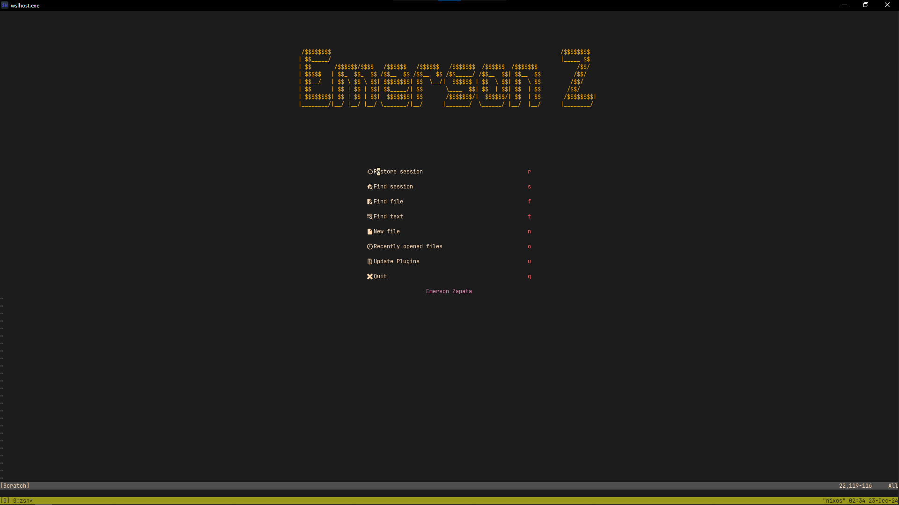
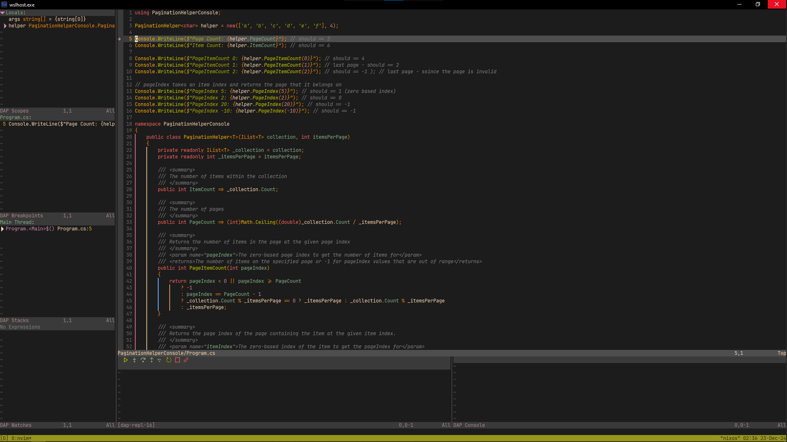
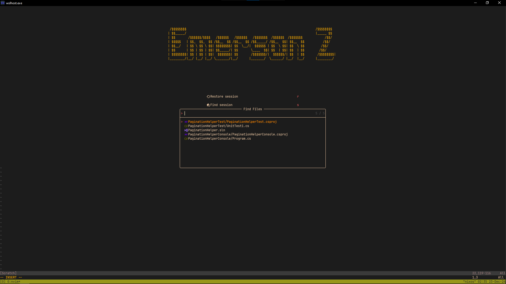
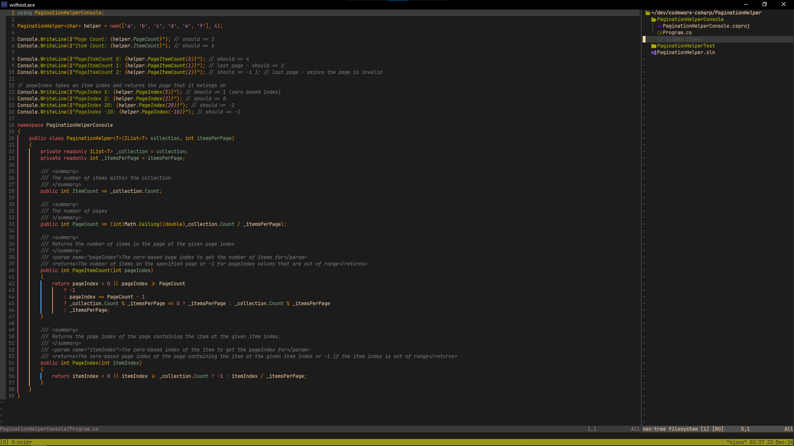

# Neovim Configurations

Welcome to my Neovim configurations! 🎉

I'm thrilled to share my setup with you. Feel free to explore, clone, use, and customize it to fit your workflow. If you find it helpful, consider giving this repository a star 🌟—it would mean a lot!

Happy coding! 🚀

## Assets

